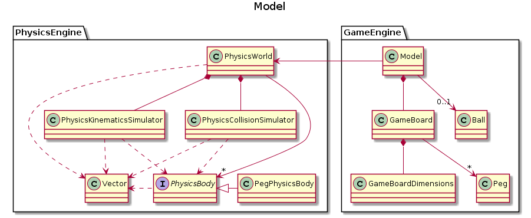

# CS3217 Problem Set 3

**Name:** Sudharshan Madhavan

**Matric No:** A0191675U

## Tips
1. CS3217's docs is at https://cs3217.netlify.com. Do visit the docs often, as
   it contains all things relevant to CS3217.
2. A Swiftlint configuration file is provided for you. It is recommended for you
   to use Swiftlint and follow this configuration. We opted in all rules and
   then slowly removed some rules we found unwieldy; as such, if you discover
   any rule that you think should be added/removed, do notify the teaching staff
   and we will consider changing it!

   In addition, keep in mind that, ultimately, this tool is only a guideline;
   some exceptions may be made as long as code quality is not compromised.
3. Do not burn out. Have fun!

## Gameplay Notes

### Level Design

When the UI loads, the user can select the peg buttons and tap to place pegs wherever desired. Pegs cannot be placed at the 
top-center of the screen from where the ball will be launched.

### Ball Launch

Once the pegs have been placed, the user should press the **start** button to start the game. After pressing start, the player can tap anywhere on the screen to launch balls. Do note that the current rudimentary design doesn't allow level design - placing of pegs - after the start button has been pressed.

The direction of the ball's initial velocity is from the top-center of the screen to the point on the screen tapped by the user. The maximum launch velocity is capped at a value maintained in `PhysicsConstants.swift`. At a given point in time, only one ball can be active in the game. Subsequent balls can be launched after the previous ball exits the stage. A ball exits the stage by hitting the bottom of the screen.

### Peg Removal

Once the ball exits the stage, the highlighted pegs will fade out. Once a peg starts fading out, it is considered removed. Subsequent balls can thus pass through fading pegs, but will not pass through presently highlighted pegs.

## Dev Guide

The application adheres to the MVC architecture conventionally used in iOS applications. The variant of MVC used is described in the diagram below.

As in the case of PS2, this application can be decomposed into model, view and controller components.

The game also adapts the game-loop pattern to update the state of the game continuously. The crux of the game is the physics engine that simulates the motion of objects.

### Model

The model *component* consists of a physics engine and a game engine. The model is responsible for storing the state of the game and provides methods to change the state. This is done by adding pegs, launching balls and so on.

#### Physics Engine

The main class of the physics engine is `PhysicsWorld`. `PhysicsWorld` maintains a collection of objects that conform to the `PhysicsBody` protocol. This class exposes an API that allows users to add and remove physics bodies, apply and remove forces on them, simulate the motion of objects and resolve collisions between objects. `PhysicsWorld` is composed of `PhysicsCollisionSimulator` and `PhysicsKinematicsSimulator`, which expose methods to simulate collisions and kinematics respectively.

`PhysicsKinematicsSimulator` simulates object behaviour following classical mechanics. `PhysicsCollisionSimulator` performs velocity resolution, as well as positional corrections. Broad phase collision detection is done first, followed by narrow phase collision detection.

The struct `Vector` models a 2D vector and supports operations like vector addition, dot product, etc. This is used to represent vector quantities like velocity, position and acceleration.

#### Game Engine

The game engine is largely unchanged from PS2 and consists of a `GameBoard` class managed by the *class* model, which serves as a facade for the model on the whole. The game engine defines what pegs and balls are and facilitates the game simulation by calling methods exposed by the `PhysicsEngine`. The main class, `Model` is composed of a `GameBoard` and a `PhysicsWorld` object. The `GameBoard` stores information about the locations of the pegs, along with their state, i.e. whether they are highlighted are not. The simulations are done by the physics engine.

Pegs are modeled by the class `Peg` and represented in the physics engine as `PegPhysicsBody` objects. Balls are represented by the class `Ball`.

The game engine, through the class `Model`, exposes an API that allows addition and removal of pegs and balls, along with the simulation of the game world.

The below class diagram summarizes the above.

### View

The view is largely unchanged from PS2 and consists of a `UIGameView` class that presents the game board to the user. Pegs are visually represented by `UIPegImageView`, which subclasses `UIImageView`. `UIGameView` exposes methods to add and remove balls and pegs to the UI, highlight them and make them fade away. It displays the balls and pegs to the users by maintaining them as sub-views in the view hierarchy.

The helper class `UIPegFactory` helps create images of the pegs and balls of the correct size to be added to `UIGameView`.

### Controller 

The controller in this application is the class `ViewController`. Its role is to mediate interaction between the view and the model components. This includes calling appropriate action methods in response to events from the UI, translating information from presentation logic to domain logic and passing it to the model, receiving a response from the model and translating it to presentation logic to update the view. The controller thus ensures that the view and the model are in sync when the application is run.

## Tests

Unit tests from PS2 have been re-used for the classes `GameBoard`, `GameBoardDimensions`, `Peg` and `Point`.

In addition to these, I propose the following unit tests.

### Unit Tests

* GameBoard.swift
    * Method - getTopCenterPoint(offsetFromTop: Double)
        * When offsetFromTop is negative, it should return nil
        * When offsetFromTop is greater than the height, it should return nil
        * When offsetFromTop is between 0 and the height, it should return a point with x coordinate at width / 2, and y coordinate at height - offsetFromTop.
    * Method - highlightPeg(at: Point)
        * When the point entered isn't contained by a peg, it should do nothing.
        * When the point entered is contained by a peg, peg.isHighlighted should be true
    * Method - removeHighlightedPegs()
        * When called, it should return a set of pegs which were highlighted.
    * General
        * When a peg is added and highlighted, calling removeHighlightedPegs() should return a set containing the added peg. Calling this method again should return an empty set.
* PhysicsKinematicsSimulator.swift
    * Method - simulateWorldFor(time: Double, bodies: dict(String: PhysicsBody))
        * When time is negative, it should do nothing.
        * When time is positive, it should update the positions of the bodies to position + velocity * time and velocity to velocity + acceleration * time.
        * When time is 1.0 and the dict contains a body of mass 1 kg with position 5x + 5y, velocity 5x + 5y and forces 5x and 5y, the body's position should be 10x + 10y and velocity should be 10x + 10y, leaving other properties unchanged.
* PhysicsCollisionSimulator.swift
    * Initializer - (xMax: Double, yMax: Double)
        * When xMax is non-positive, it should return nil
        * When yMax is non-positive, it should return nil
        * When xMax and yMax are positive, it should return the object.
    * Method - simulateCollisions()
        * When there are two bodies that intersect each other, their velocities should be adjusted following collision. Their positions should be adjusted to ensure they no longer overlap.
        * When there is a body at the left or right boundary of the physics world, its horizontal velocity should be reversed.
        * When there is a body at the top or bottom boundary of the physics world, its vertical velocity should be reversed.
        * When there is a body of infinite mass, it should be unmoved after collisions.
* PhysicsWorld.swift
    * Initializer - (xMax: Double, yMax: Double)
        * When xMax or yMax are non-positive, it should return nil
    * Method - addPhysicsBody(body: PhysicsBody, tag: String)
        * When a body with the entered tag already exists, it should return false and not add the object.
        * When a body with a unique tag is input, it should add the body and return true.
    * Method - removePhysicsBody(tag: String)
        * When no body with the entered tag exists, it should return nil
        * When a body with the entered tag exists, it should return the body and remove it from the world.
    * Method - applyForceOnBody(tag: String, force: Vector)
        * When no body with the entered tag exists, it should do nothing
        * When a body with the entered tag exists, it should add the force to the body's list of forces.
    * Method - removeForcesOnBody(tag: String)
        * When no body with the entered tag exists, it should do nothing.
        * When a body with the entered tag exists, it should empty the body's list of forces.
        
### Integration Tests

* Peg Placement
    * Pegs can only be placed before the `start` button is pressed. After `start` is pressed, pegs cannot be placed.
    * Pegs can be placed anywhere on the board except the edges.
    * When tapped at the top center of the screen, nothing should happen (since the ball will be launched from here)
* Ball Launch
    * Before `start` button is pressed
        * When tapped, no ball should be launched.
    * After `start` button is pressed
        * When tapped with no ball in play, a ball should be launched from the top center in the direction of the tap location. 
        * When tapped with an existing ball in play, nothing should happen.
        * When tapped closer to the top center, the ball should launch with a low velocity.
        * When tapped far away from the top center, the ball should launch with a high velocity.
        * When tapped beyond the distance corresponding to the velocity threshold, the ball should launch with the threshold velocity.
* Ball Movement
    * When tapped, the ball's initial velocity should be in the direction of the tap location, with a downward drift due to gravity.
* Collisions
    * When launched towards the side walls, the ball's horizontal velocity should be reversed.
    * When colliding with pegs, the ball should bounce away from the peg depending on the collision normal.
    * When colliding at a lesser velocity, the ball should bounce to a lesser height.
    * When wedged between two consecutively placed pegs, the ball should remain at the wedged location.
* Peg Highlighting and Removal
    * When the ball collides against a peg, the peg should highlight and remain lit.
    * When the ball exits the stage, all highlighted pegs should fade out.
    * When a new ball is launched, it should be able to pass through *fading* pegs without colliding.

## Written Answers

### Design Tradeoffs
> When you are designing your system, you will inevitably run into several
> possible implementations, in which you need to choose one among all. Please
> write at least 2 such scenarios and explain the trade-offs in the choices you
> are making. Afterwards, explain what choices you choose to implement and why.
>
> For example (might not happen to you -- this is just hypothetical!), when
> implementing a certain touch gesture, you might decide to use the method
> `foo` instead of `bar`. Explain what are the advantages and disadvantages of
> using `foo` and `bar`, and why you decided to go with `foo`.

#### Design Consideration - Shape of PhysicsBody

Apart from physical quantities like mass, velocity, position and so forth, a fundamental property of rigid bodies is shape. In my case, the protocol `PhysicsBody` was quite easy to formulate in terms of other physical properties. However, I had to greatly deliberate about the incorporation of a shape to the rigid bodies.

##### Alternative - Make Separate Protocols 

One way I could solve this problem was by making separate protocols - each protocol conforming to `PhysicsBody` - to represent different shapes, like `CircularPhysicsBody`, `RectangularPhysicsBody`, and so on.

Pros:-

* Each protocol only needs to address the idiosyncrasies of its associated shape.

Cons:-

* Need to make a new protocol for every additional shape supported.
* Could lead to a complex hierarchy by introducing more shapes.
* Possible to have `PhysicsBody` objects without a shape.

##### Alternative - Use an Enumeration

In this case, an enumeration `Shape` is created to support a number of different shapes in the form of associated types. The protocol `PhysicsBody` has an additional attribute shape which stores the shape of the body. This is akin to saying that shape is a characteristic of rigid bodies.

Pros:-

* Uses composition over inheritance
* Easy to implement

Cons:- 

* Having too many shapes could make switch statements verbose.
* Convoluted process to get associated type information.

I decided to use an enumeration since this forces `PhysicsBody` objects to have a shape. I couldn't find any major differences between the two alternatives, but chose to use an enumeration due to ease of implementation. In hindsight, another alternative could be to make protocols belonging to shapes unrelated to PhysicsBody, like `Circular`, `Rectangular`, etc.  This method will also allow `PhysicsBody` objects to be made without shapes, however. Ultimately, all three methods will run into the same complexities in collision handling.

#### Design Consideration - Physics Engine Design

##### Alternative - Physics Engine Only Simulates

The physics engine only provides methods to simulate an existing collection of objects. It doesn't have the ability to store a collection of objects.

Pros:-

* Physics engine has a single limited responsibility.
* Since only the model has a collection of objects, it is easier on the memory. There is no need to tag objects.

Cons:-

* Model has to keep track of physical properties of objects that are more relevant to the physics engine, like mass, velocity and forces acting on the object.

##### Alternative - Physics Engine has State

The physics engine stores a collection of `PhysicsBody` objects and provides methods to add them.

Pros:-

* Physics engine is self limiting
* Physical quantities are handled through methods exposed by the physics engine, easing the burden on the model.

Cons:-

* Maintaining two collections of the same objects, albeit via different classes burdens the memory.
* Need to maintain tags to facilitate communication between model and physics engine.

I chose to go for a stateful physics engine since this makes model quite simple. Since memory isn't a major issue when objects aren't ubiquitous, I felt that this was a fair trade off.

